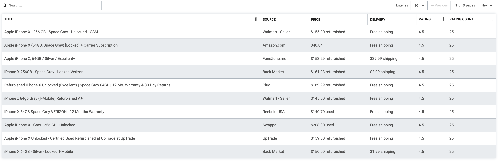
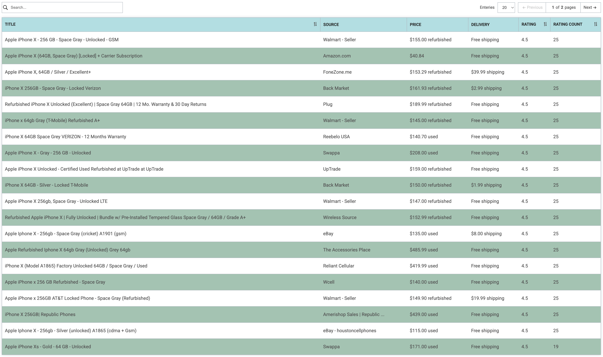

# React Data Table Grid


A reusable and customizable React component for displaying tabular data.
It supports dynamic columns and rows with clean, minimal styling — ideal for rendering lists, reports, or admin dashboards with minimal setup.

This lightweight and minimalistic data table includes essential features out of the box.



## Key build-in features

- ✅ Sorting by column
- ✅ Searching
- ✅ Pagination
- ✅ Custom theming
- ✅ Responsive

## 📦 Installation

```bash
npm install data-table-grid
```
## 🚀 Usage

```js
import DataTableGrid  from "data-table-grid";


const users = [
  { id: 1, name: "Alice", email: "alice@example.com" },
  { id: 2, name: "Bob", email: "bob@example.com" },
];

const headers = [
  { 
    label: "ID",
    key: "id"
  },
  {
    label: "User name",
    key: "name",
    sorting:true
  },
  {
    label: "Email address",
    key: "email"
  },
];

function App() {
  return (
    <DataTable 
        headers={headers} 
        rows={users} 
        showActionBar = {true}
        stripe= {true}
        className={'cutom-class-name'}
        theme={{
            text:{
                default:'#212529',
            }
            background:{
                default:'#0076bf',
            },
            border:{
                default:'#dee2e6'
            }
            
        }}
    />
  );
}

```

## props
| Name | Type | Default | Description |
| --- | --- | --- | --- |
| showActionBar | Boolean   | true | Determines whether to display the top action bar, which includes search, entry count, and pagination controls.
| headers       | Object[]  |      | Defines the columns displayed in the table header. Each column is mapped to row data using the `name` key.
| stripe        | Boolean   | true | Enable or disable striped styling for alternating table rows. 
| rows          | object[]  |      | Defines the dataset to be displayed in the table. Each object in the array represents a single row.
| theme         | Object    |      | Allows customization of the table's color scheme to match your design preferences.
| onRowClick    | function  |      | On row click, the data of the selected row is returned.
| className     | string    |      | A custom `className` for the table's container wrapper, enabling custom styling.

## Theming
The table's color scheme is theme-based and fully customizable via props. You can provide your own color variants to modify the table's look and feel.

### Default table color scheme.
```js
  const theme = {
      text:{
          dark:'#202020',
          default:'#515151'
      },
      background:{
          default:"#ffffff",
          striped:'#e9ecef',
          warn:'#d62828',
          header:'#ffffff',
          body:'#ffffff'
      },
      shade:{
          default:'#dee2e6'
      },
      border:{
          default:'#adb5bd'
      }
  }
```

### Custom table color sheme



